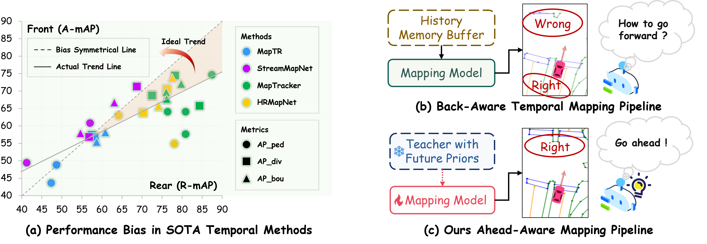

# AMap

[CVPR 2026] **AMap: Distilling Future Priors for Ahead-Aware Online HD Map Construction**

Ruikai Li, Xinrun Li, Mengwei Xie, Hao Shan, Shoumeng Qiu, Xinyuan Chang, Yizhe Fan, Feng Xiong, Han Jiang, Yilong Ren, Haiyang Yu, Mu Xu, Yang Long, Varun Ojha, Zhiyong Cui

Beihang University, AMap Alibaba Group, Newcastle University, Durham University

Equal contribution. Corresponding author included in the author list.

[](https://buaa-rickyli.github.io/AMap/)
[](https://github.com/BUAA-RickyLi/AMap)
[](https://arxiv.org/abs/2512.19150)
[](https://arxiv.org/pdf/2512.19150)

## Teaser



## Abstract

Online High-Definition (HD) map construction is pivotal for autonomous driving. While recent approaches leverage historical temporal fusion to improve performance, we identify a critical safety flaw in this paradigm: it is inherently spatially backward-looking. These methods predominantly enhance map reconstruction in traversed areas, offering minimal improvement for the unseen road ahead. Crucially, our analysis of downstream planning tasks reveals a severe asymmetry: while rearward perception errors are often tolerable, inaccuracies in the forward region directly precipitate hazardous driving maneuvers. To bridge this safety gap, we propose AMap, a novel framework for ahead-aware online HD mapping. We pioneer a distill-from-future paradigm, where a teacher model with privileged access to future temporal contexts guides a lightweight student model restricted to the current frame. This process implicitly compresses prospective knowledge into the student model, endowing it with look-ahead capabilities at zero inference-time cost. Technically, we introduce a Multi-Level BEV Distillation strategy with spatial masking and an Asymmetric Query Adaptation module to effectively transfer future-aware representations to the student's static queries. Extensive experiments on the nuScenes and Argoverse 2 benchmark demonstrate that AMap significantly enhances current-frame perception, especially in critical forward regions, while maintaining the efficiency of single current frame inference.

## Highlights

- Ahead-aware online HD mapping for safety-critical forward regions.
- Distill future temporal priors into a current-frame student model.
- Zero extra inference-time cost while improving forward-region quality.
- Strong performance on both nuScenes and Argoverse 2.

## Repository Status

- This repository hosts the official project page and public assets for AMap.
- Code and additional resources will be released in this repository.

## Citation

If you find this work useful, please cite:

```bibtex
@article{li2025amap,
  title={AMap: Distilling Future Priors for Ahead-Aware Online HD Map Construction},
  author={Li, Ruikai and Li, Xinrun and Xie, Mengwei and Shan, Hao and Qiu, Shoumeng and Chang, Xinyuan and Fan, Yizhe and Xiong, Feng and Jiang, Han and Ren, Yilong and others},
  journal={arXiv preprint arXiv:2512.19150},
  year={2025}
}
```

## License

This project is released under the MIT License. See `LICENSE` for details.
